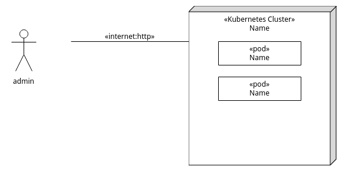

# Kubernetes Dashboard
run kubernetes dashboard in codespace

TLDR;

```bash
pip install ansible kubernetes # install ansible python3-kubernetes with package manager python
ansible-playbook up.yml
kubectl -n default port-forward deployment/dashboard-kong 8000:8000
```
You will need a bearer token to access the dashboard. Open a 2nd terminal window and run:

```bash
kubectl -n default create token admin-user
```

If you need to delete a cluster and start over you can run:

```bash
ansible-playbook down.yml
```

Then you can take it from the top.

Note: This also works (faster) in vscode local with docker desktop installed. 

1. From the command palette `Dev Containers: Clone Repository in Container Volume`. 

2. Choose this repository `https://github.com/rhildred/INFO8985-observability.git`. 

3. Follow the steps from TLDR;

The deliverable for the lab is to create a deployment diagram using [https://www.umletino.com/umletino.html](https://www.umletino.com/umletino.html). This can be done by dragging and dropping pods you see with the `kubectl get pods` command. A starting place would be something like this:



Hopefully this is a gentle introduction to ansible and kubernetes.
